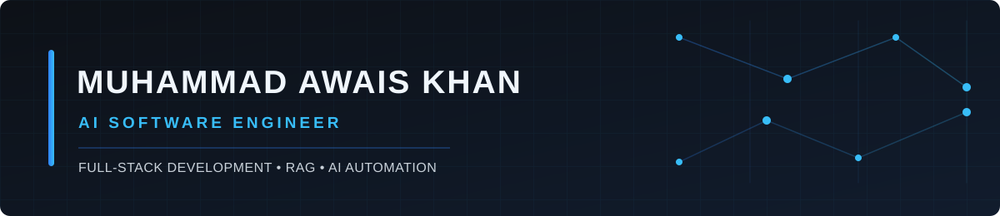

<!-- awaisbaloch0334 · GitHub profile README -->
<!-- Palette: navy #0D1117 · azure #2F81F7 · cyan #38BDF8 -->

<p align="center"></p>

<p align="center">
  <a href="https://github.com/awaisbaloch0334"></a>
</p>
<p align="center">
  <a href="https://linkedin.com/in/muhammad-awais-khan-9279672b8"></a>
  <a href="mailto:awaisbaloch0334@gmail.com"></a>
  <a href="https://github.com/awaisbaloch0334"></a>
  
  
</p>

---

### 🧠 About Me

```ts
class MuhammadAwaisKhan {
  title      = "AI Software Engineer";
  location   = "Multan, Pakistan 🇵🇰";
  education  = "BS Computer Science — NFC-IET, Multan (2022 – 2026)";
  focus      = "Full-stack engineering · RAG · AI automation · QA & testing";

  shipping() {
    return [
      "T-Rex — shared platform, scraper and RAG agent (internship team)",
      "StackAssure — software quality analysis and testing",
      "Parklock Engine — smart parking frontend and backend",
      "Clarifyd — AI legal assistant for startups (frontend)",
      "Bytescore — cross-platform exam prep (backend)",
      "AidwiseAI — AI scholarship matching (backend)",
    ];
  }

  buildingWith() {
    return ["Python", "FastAPI", "React", "Next.js", "TypeScript", "PostgreSQL", "pgvector", "Redis", "Celery", "Docker"];
  }

  mantra = "user-focused, reliable, shipped";
}
```

---

### 🛠️ Tech Stack

<p align="center"><sub>LANGUAGES &amp; CORE</sub><br/>
 </p>
<p align="center"><sub>FRONTEND</sub><br/>
     </p>
<p align="center"><sub>BACKEND &amp; DATA</sub><br/>
       </p>
<p align="center"><sub>AI ENGINEERING &amp; AUTOMATION</sub><br/>
     </p>
<p align="center"><sub>QA &amp; TESTING</sub><br/>
       </p>
<p align="center"><sub>TOOLS &amp; PRACTICES</sub><br/>
    </p>

---

### 🚀 Featured Project

<table><tr><td width="70%" valign="top">
<h4>T-Rex — AI-Powered Autonomous CRM &amp; Outreach Platform</h4>
<p><em>Internship team project</em></p>
<p>I contributed to the shared platform, CRM integration, website knowledge base, and documentation assistant.</p>
<ul><li>Built the shared React/FastAPI platform foundation, auth and OTP flows, and Docker setup.</li><li>Built the TPI Engine and implemented HubSpot OAuth and lead synchronization.</li><li>Built the Scraper &amp; Knowledge Base Engine for crawling, chunking, embeddings, and pgvector storage.</li><li>Built the Agent Engine for semantic retrieval and Groq-powered documentation RAG.</li></ul>
</td><td width="30%" align="center" valign="middle"><sub>INTERNSHIP TEAM PROJECT</sub><br/><br/>Shared platform + TPI<br/>HubSpot integration<br/>Website knowledge base<br/>Documentation-grounded RAG</td></tr></table>

---

### 📦 More Projects

<table>
<tr><td width="50%" valign="top"><h4><a href="https://github.com/awaisbaloch0334/StackAssure-QA-Analyzer-and-Tester">StackAssure</a></h4><p><strong>Full-stack project</strong> · Software quality analyzer</p><p>Runs browser, API, performance, and dependency checks with AI-assisted reporting; validated on a controlled fixture with 11/11 seeded defects detected and 0 false positives.</p></td><td width="50%" valign="top"><h4><a href="https://github.com/awaisbaloch0334/CampaignPilot-RAG-AI-EMAIL-CAMPAIGNER">CampaignPilot AI</a></h4><p><strong>Full-stack project</strong> · Email campaign platform</p><p>FastAPI/React email campaigns with HubSpot contacts, Gemini drafts, and website-based retrieval.</p><p><code>FastAPI</code> <code>React</code> <code>HubSpot</code></p></td></tr>
<tr><td width="50%" valign="top"><h4><a href="https://github.com/awaisbaloch0334/EMBEDDABLE-RAG-AI-CHATBOT">Embeddable RAG AI Chatbot</a></h4><p><strong>Full-stack project</strong></p><p>Multi-tenant website ingestion and pgvector retrieval for an embeddable streaming chat widget.</p><p><code>pgvector</code> <code>RAG</code></p></td><td width="50%" valign="top"><h4>Parklock Engine</h4><p><strong>Full-stack project</strong> · Smart parking system</p><p>React parking dashboard and stress tests backed by Java/Spring Boot and PostgreSQL.</p><p><a href="https://github.com/awaisbaloch0334/parklock-engine-frontend">Frontend</a> · <a href="https://github.com/awaisbaloch0334/parklock-engine-backend">Backend</a></p><p><code>React</code> <code>Spring Boot</code> <code>PostgreSQL</code></p></td></tr>
<tr><td width="50%" valign="top"><h4><a href="https://github.com/awaisbaloch0334/AI-DOCX-GENERATOR">AI DOCX Generator</a></h4><p><strong>Backend project</strong></p><p>FastAPI service for placeholder detection and style-preserving DOCX generation with e-signatures.</p><p><code>FastAPI</code></p></td><td width="50%" valign="top"><h4><a href="https://github.com/awaisbaloch0334/MultiTools">MultiTools</a></h4><p><strong>Full-stack project</strong></p><p>React/FastAPI utilities for images, PDFs, audio, and media.</p><p><code>React</code> <code>FastAPI</code></p></td></tr>
<tr><td width="50%" valign="top"><h4><a href="https://aidwiseai.com/">AidwiseAI</a></h4><p><strong>Backend Developer</strong> · AI scholarship matching</p><p>Built FastAPI backend and Celery/Redis pipelines with pgvector and Neo4j matching.</p><p><code>FastAPI</code> <code>Celery</code> <code>Redis</code> <code>pgvector</code> <code>Neo4j</code></p></td><td width="50%" valign="top"><h4><a href="https://clarifyd.app/">Clarifyd.app</a></h4><p><strong>Frontend Developer</strong> · AI legal assistant (FYP)</p><p>Built and shipped a responsive React/Next.js frontend with Clerk auth and Node.js integration.</p><p><code>React</code> <code>Next.js</code> <code>Clerk</code> <code>Node.js</code></p></td></tr>
<tr><td width="50%" valign="top"><h4><a href="https://www.bytescore.app/">Bytescore.app</a></h4><p><strong>Backend Developer</strong> · Exam prep (HEC NSCT)</p><p>Built backend and APIs for 11,000+ MCQs, practice tests, timed mocks, and analytics.</p></td><td width="50%" valign="top"><h4><a href="https://github.com/HaiderNaqvi-5/EMC-Veritas">EMC-Veritas</a></h4><p><strong>Contributor</strong></p><p>Certificate, leadership-recognition, and public-verification platform for the Event Management Club at NFC-IET Multan, covering administrative workflows, secure document issuance, templates, signatures, student records, and public verification.</p><p><code>FastAPI</code> <code>React</code> <code>Supabase</code> <code>Cloudflare Pages</code> <code>Render</code></p></td></tr>
</table>

---

### 📈 GitHub Stats

<p align="center"></p>
<p align="center"> </p>
<p align="center"></p>
<p align="center"></p>

---

### 🐍 Watch My Contributions Get Eaten

<p align="center"><picture><source media="(prefers-color-scheme: dark)" srcset="https://raw.githubusercontent.com/awaisbaloch0334/awaisbaloch0334/output/github-snake-dark.svg" /><source media="(prefers-color-scheme: light)" srcset="https://raw.githubusercontent.com/awaisbaloch0334/awaisbaloch0334/output/github-snake.svg" /></picture></p>

---

### 💡 Dev Quote

<p align="center"></p>

---

### ⚡ Fun Facts

- 🧠 Built the backend behind **11,000+ MCQs** for the Bytescore exam-prep app
- 🕸️ Wired a **Neo4j knowledge graph + pgvector** matching engine for AidwiseAI
- ⚙️ Ran **async pipelines** with Celery + Redis inside a FastAPI modular monolith
- 🚢 Set up **CI/CD** with GitHub Actions and Docker Compose deployment
- 🚀 Shipped Clarifyd's frontend to production in a 4-person cross-functional team
- 🧪 Built StackAssure to connect real test evidence to actionable DOCX reports
- 🅿️ Built Parklock Engine across React and Spring Boot repositories
- 🤖 Worked on T-Rex shared platform, website knowledge ingestion and RAG agent

---

<p align="center"><em>Last updated: September 2026 · stats refreshed live from GitHub</em></p>

<p align="center"><i>"Frontend that feels right, backend that holds up."</i></p>
